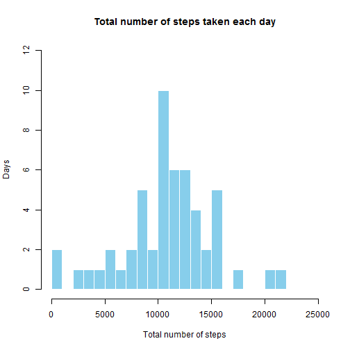
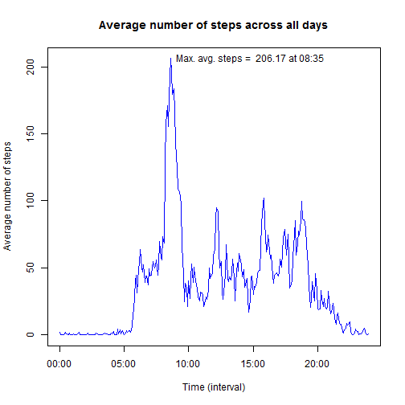
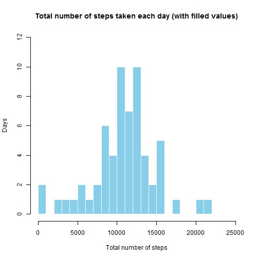
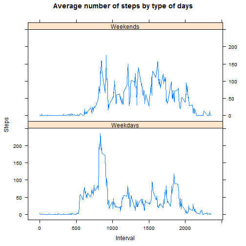

# Reproducible Research: Peer Assessment 1

The dataset for this assignment was downloaded 09 December 2015 from the 
Course web site:

* Dataset: [Activity monitoring data](https://d396qusza40orc.cloudfront.net/repdata%2Fdata%2Factivity.zip) [52K]

NOTE: Before 'kniting' this .Rmd document, please, be sure that:

* archive _activity.zip_ has been downloaded and placed into your working
directory;
* working directory has been properly set with the _setwd()_;
* package _"lattice"_ has been installed.

Before start of investigation I preserve the current locale and change
it to English for correct weekday's names. Saved locale will be restored
at the end.

```r
myLocale <- Sys.getlocale("LC_ALL")
Sys.setlocale("LC_ALL", "English")
```

## 1. Loading and preprocessing the data

### Loading the data

Next code reads the dataset file _activity.csv_ from supplied zip-archive.

```r
data <- read.csv(unz("activity.zip", "activity.csv"))
unlink("hpc.zip")
```

The variables included in this dataset are:

* __steps__: Number of steps taking in a 5-minute interval (missing values 
are coded as NA)
* __date__: The date on which the measurement was taken in YYYY-MM-DD format
* __interval__: Identifier for the 5-minute interval in which measurement 
was taken

The dataset is stored in a comma-separated-value (CSV) file and there are
a total of 17,568 observations in this dataset.

### Preprocesing of the data

Here is an example fragment of the source data:

```r
data[1600:1605, ]
```

```
##      steps       date interval
## 1600   511 2012-10-06     1315
## 1601   506 2012-10-06     1320
## 1602   486 2012-10-06     1325
## 1603   171 2012-10-06     1330
## 1604    12 2012-10-06     1335
## 1605    24 2012-10-06     1340
```

As you can see the variable _interval_ actually contains the time information.
For example '345' means 3h45m, '1720' means 17h20m e.t.c.
In order to make results of analysis more readable I converted intervals into 
time format and made a new variable __time__.

```r
data$time <- as.POSIXct(strptime(paste(data$interval %/% 100,
                                       data$interval %% 100),
                                 "%H %M"))
```

In order to ignore missing values in the source dataset (as it is required in
the first part of assignment) I made a subset of the source data without
observations with NA values.

```r
subdata <- na.omit(data)
```

## 2. What is mean total number of steps taken per day?

### Histogram of the total number of steps taken each day

To make a histogram of the total number of steps I summed up all _steps_
for each _date_:

```r
steps_per_day <- aggregate(steps ~ date, data = subdata, sum)
hist(
        steps_per_day$steps,
        main = "Total number of steps taken each day",
        xlab = "Total number of steps",
        ylab = "Days",
        col = "skyblue",
        border = FALSE,
        xlim = c(0, 25000),
        ylim = c(0, 12),
        breaks = 25
)
```

 

### Mean and median of the total number of steps taken per day

After that I calculated the mean and median of the total number of steps
taken per day:

```r
mean_steps_per_day <- mean(steps_per_day$steps)
median_steps_per_day <- median(steps_per_day$steps)
```

The mean of the total number of steps taken per day is about 
__10766.19__
and the median is
__10765__.

As we can see they are almost equal. This mean that the distribution of steps
per day is almost symmetric.

## 3. What is the average daily activity pattern?

Average number of steps across all days I calculated as the mean value of all
steps aggregated by the time intervals:

```r
average_steps <- aggregate(steps ~ time + interval, data = subdata, mean)
```

Next I found the 5-minute interval which contains the maximum number of steps:

```r
max_average_steps <- average_steps[which.max(average_steps$steps), ]
```

Average daily activity pattern and 5-minute interval with maximum number of
steps are shown at the next plot:

```r
plot.new()
plot(
        average_steps$time, average_steps$steps,
        main = "Average number of steps across all days",
        xlab = "Time (interval)",
        ylab = "Average number of steps",
        type = "l",
        col = "blue"
)
text(max_average_steps$time,
     max_average_steps$steps,
     paste("Max. avg. steps = ", round(max_average_steps$steps, digits = 2),
           "at", format(max_average_steps$time, format = "%H:%M")),
     pos = 4)
```

 

As you can see maximum average steps
__206.17__ 
was made during __835__ interval.

## 4. Imputing missing values

### The total number of missing values in the dataset


```r
na_total <- sum(is.na(data))
```

The total number of missing values in the dataset is
__2304__.

### A strategy for filling in all of the missing values in the dataset

There are a lot of various factors which can affect daily human activity.
It could be time of day, day of week, parts of week (weekends or weekdays), 
holidays, seasons of year, weather conditions and many others.

Available dataset is quite terse but it has some important information:
date and time. It makes possible to input missing data by the slices
defined by couples 'time of day' and 'day of week'.

### Creating a new dataset with the missing data filled in

To make such transformation I added information about days of week into new
variable __weekday__:

```r
data$weekday <- weekdays(as.Date(data$date))
```

Next I calculated average values of steps aggregated by _time_ and _weekday_:

```r
data_by_weekdays <-
        aggregate(steps ~ time + weekday, data = data, mean)
```

Here is an example of one date-time slice before the filling of missing values:

```r
data[data$interval == "730" & data$weekday == "Friday",
     c("steps", "date", "interval", "weekday")]
```

```
##       steps       date interval weekday
## 1243    126 2012-10-05      730  Friday
## 3259    117 2012-10-12      730  Friday
## 5275      0 2012-10-19      730  Friday
## 7291      0 2012-10-26      730  Friday
## 9307    121 2012-11-02      730  Friday
## 11323    NA 2012-11-09      730  Friday
## 13339     0 2012-11-16      730  Friday
## 15355     0 2012-11-23      730  Friday
## 17371    NA 2012-11-30      730  Friday
```

Based on the foregoing in order to fill missing values I merged source
dataset with _data_by_weekdays_ by the fields _time_ and
_weekdays_ and replaced missed values with rounded averages (because number of steps are integers):

```r
data_full <- merge(data, data_by_weekdays, by = c("time", "weekday"))
data_full$steps <- ifelse(is.na(data_full$steps.x),
                          round(data_full$steps.y, digits = 0),
                          data_full$steps.x)
data_full <- data_full[with(data_full, order(date, time)), ]
```

Here is the same date-time slice after the filling of missing values:

```r
data_full[data_full$interval == "730" & data_full$weekday == "Friday",
     c("steps", "date", "interval", "weekday")]
```

```
##      steps       date interval weekday
## 5496   126 2012-10-05      730  Friday
## 5493   117 2012-10-12      730  Friday
## 5491     0 2012-10-19      730  Friday
## 5497     0 2012-10-26      730  Friday
## 5499   121 2012-11-02      730  Friday
## 5494    52 2012-11-09      730  Friday
## 5492     0 2012-11-16      730  Friday
## 5495     0 2012-11-23      730  Friday
## 5498    52 2012-11-30      730  Friday
```

### A histogram of the total number of steps taken each day

To make a new histogram of the total number of steps taken each day I summed up
again all _steps_ for each _date_ but now on the dataset with filled missed
values:

```r
steps_per_day_full <- aggregate(steps ~ date, data = data_full, sum)
hist(
        steps_per_day_full$steps,
        main = "Total number of steps taken each day (with filled values)",
        xlab = "Total number of steps",
        ylab = "Days",
        col = "skyblue",
        border = FALSE,
        xlim = c(0, 25000),
        ylim = c(0, 12),
        breaks = 25
)
```

 

### New mean and median of the total number of steps taken per day


```r
new_mean_steps_per_day <- mean(steps_per_day_full$steps)
new_median_steps_per_day <- median(steps_per_day_full$steps)
```

The new mean of the total number of steps taken per day is about 
__10821.1__
and the new median is
__11015__.

### What is the impact of imputing missing data?

After filling the missing data we can see that the mean and the median
values of the total number of steps taken per day increased. From my point of
view the reason is that in order to fill the missing data the source
dataset was not processed as single unit but by the date-time slices which are
differ by the amount of days and missed values. In this case more heavy
slices (in terms of mean amount of steps made by less days) made bigger impact
to common mean value.

At the same time the gap between mean and median values increased. This mean
that the distribution of steps per day became less symmetric.

## 5. Are there differences in activity patterns between weekdays and weekends?

To visualise the differences in activity patterns between weekdays and weekends
I made new variable __type_of_day__ which separates weekdays and weekends:

```r
data$type_of_day <- ifelse(data$weekday == "Saturday" | 
                           data$weekday == "Sunday",
                           "Weekends", "Weekdays")
```

After that I made a time series plot of the 5-minute intervals
(as it was required in the task) and the average number of steps, averaged
across all weekday days or weekend days:

```r
average_steps_by_daytype <- aggregate(steps ~ interval + type_of_day,
                                      data = data, mean)
xyplot(
        data = average_steps_by_daytype,
        steps ~ interval | type_of_day,
        main = "Average number of steps by type of days",
        xlab = "Interval",
        ylab = "Steps",
        layout = c(1,2),
        scales = list(format = "%H:%M"),
        type = "l"
)
```

 

As you can see patterns of activities during weekdays and weekends are visibly
different:

* peaks of the activity during workdays are observed mostly at the beginning
and at the end of the afternoon;
* activity during weekends is distributed along the day more uniformly.

At the end, as I promised, I restore the default locale:

```r
Sys.setlocale("LC_ALL", myLocale)
```
